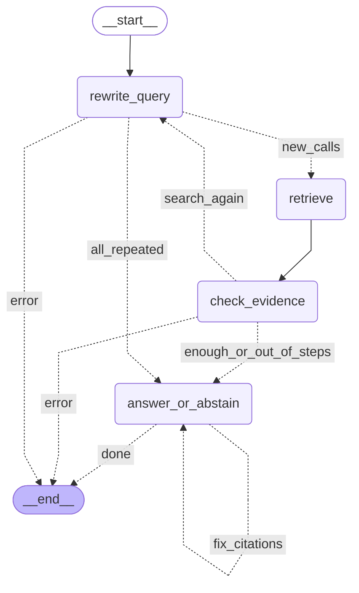

# Agent graph

Generated by `python -m agent.draw_graph` from the compiled LangGraph.

```mermaid
---
config:
  flowchart:
    curve: linear
---
graph TD;
	__start__([<p>__start__</p>]):::first
	rewrite_query(rewrite_query)
	retrieve(retrieve)
	check_evidence(check_evidence)
	answer_or_abstain(answer_or_abstain)
	__end__([<p>__end__</p>]):::last
	__start__ --> rewrite_query;
	answer_or_abstain -. &nbsp;done&nbsp; .-> __end__;
	check_evidence -. &nbsp;error&nbsp; .-> __end__;
	check_evidence -. &nbsp;enough_or_out_of_steps&nbsp; .-> answer_or_abstain;
	check_evidence -. &nbsp;search_again&nbsp; .-> rewrite_query;
	retrieve --> check_evidence;
	rewrite_query -. &nbsp;error&nbsp; .-> __end__;
	rewrite_query -. &nbsp;all_repeated&nbsp; .-> answer_or_abstain;
	rewrite_query -. &nbsp;new_calls&nbsp; .-> retrieve;
	answer_or_abstain -. &nbsp;fix_citations&nbsp; .-> answer_or_abstain;
	classDef default fill:#f2f0ff,line-height:1.2
	classDef first fill-opacity:0
	classDef last fill:#bfb6fc
```
