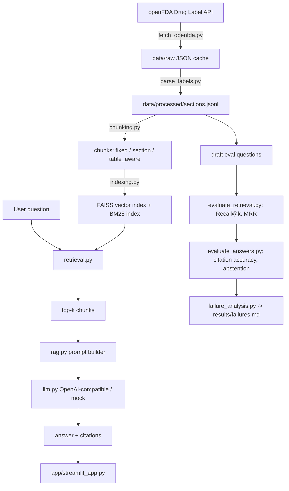

# Architecture

```mermaid
flowchart TD
    A[openFDA Drug Label API] -->|fetch_openfda.py| B[data/raw JSON cache]
    B -->|parse_labels.py| C[data/processed/sections.jsonl]
    C -->|chunking.py| D[chunks: fixed / section / table_aware]
    D -->|indexing.py| E[FAISS vector index + BM25 index]
    Q[User question] --> F[retrieval.py]
    E --> F
    F --> G[top-k chunks]
    G --> H[rag.py prompt builder]
    H --> I[llm.py OpenAI-compatible / mock]
    I --> J[answer + citations]
    C --> K[draft eval questions]
    K --> L[evaluate_retrieval.py: Recall@k, MRR]
    L --> M[evaluate_answers.py: citation accuracy, abstention]
    M --> N[failure_analysis.py -> results/failures.md]
    J --> O[app/streamlit_app.py]
```

Data flows one way: raw JSON is cached once, everything downstream is rebuilt
from `data/processed/sections.jsonl`, so the pipeline is reproducible without
re-downloading labels.
